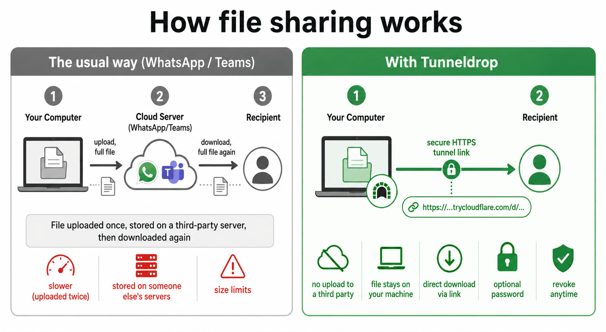

<p align="center">
  
</p>

<h1 align="center">Tunneldrop</h1>

<p align="center">
  Turn any local file into a temporary, shareable HTTPS link — no uploads to a
  third party, the file never leaves your machine.
</p>

<p align="center">
  <a href="https://subair-zufi.github.io/tunneldrop/"><b>🌐 Website &amp; downloads</b></a> ·
  <a href="https://github.com/subair-zufi/tunneldrop/releases/latest">Latest release</a>
</p>

Drop a file onto the window, get a `https://*.trycloudflare.com/d/<token>` link,
send it to anyone — they download straight from your machine through a Cloudflare
quick tunnel. Optional password protection. Revoke any time.

Built with [Tauri 2](https://tauri.app/) (Rust + plain HTML/CSS/JS), a small
[axum](https://github.com/tokio-rs/axum) HTTP server, and
[cloudflared](https://github.com/cloudflare/cloudflared) as a bundled sidecar.

## Why Tunneldrop?

With WhatsApp, Teams, email, or any cloud drive, your file is **uploaded once**
to a third-party server, stored there, and then **downloaded again** by the
recipient. That means the full file travels twice, sits on someone else's
servers, and runs into size limits.

Tunneldrop skips the middleman: the file **stays on your machine**, and the
recipient downloads it **directly** over a secure HTTPS tunnel link — no
third-party upload, no storage, and you can revoke the link any time.

<p align="center">
  
</p>

| | The usual way (WhatsApp / Teams) | With Tunneldrop |
|---|---|---|
| **Where the file lives** | Copied onto a third-party server | Stays on your machine |
| **Transfer** | Uploaded once, downloaded again (travels twice) | Downloaded directly via link |
| **Size limits** | Imposed by the service | Only your connection |
| **Control** | Lives on their servers | Revoke any time; gone on app quit |
| **Privacy** | Stored by a third party | Never handed to a third party |

> **Trade-off:** because the recipient pulls straight from your computer, your
> machine must stay on and online until they finish downloading.

## Features

- Drag-and-drop or file-picker share creation.
- A single Cloudflare quick tunnel is started lazily and torn down when the
  last share is revoked.
- Optional Argon2-hashed password per share.
- Tray icon — closing the window hides it, **Quit** from the tray fully exits
  and tears the tunnel down.
- HTML-escaped landing page; `Content-Disposition` filename sanitized — safe
  against shares with hostile file names.
- No external state — shares live in memory and disappear on app restart.

## How it works

1. The app picks a free localhost port and starts an axum server on it.
2. When you create the first share, it spawns `cloudflared tunnel --url
   http://127.0.0.1:<port>` and scrapes the public `*.trycloudflare.com` URL
   from its output.
3. Each share gets a random token and is reachable at `<tunnel>/d/<token>`.
4. Revoking the last share kills the cloudflared child process.

## Prerequisites

- **Rust** (stable) — install via [rustup](https://rustup.rs/).
- **Tauri CLI** — `cargo install tauri-cli --version "^2"`.
- **cloudflared** — needed at runtime. Either:
  - install it on PATH (`brew install cloudflared`, `winget install
    Cloudflare.cloudflared`, etc.), **or**
  - drop a binary into `src-tauri/binaries/` using the naming convention below
    so Tauri can bundle it as a sidecar.

### Linux system dependencies

On Debian/Ubuntu (and derivatives), install the libraries required to build
and run the WebKit-based UI and the Ayatana tray icon:

```bash
sudo apt-get update
sudo apt-get install -y \
    libgtk-3-dev libwebkit2gtk-4.1-dev \
    libayatana-appindicator3-dev librsvg2-dev
```

> **GNOME tray note:** GNOME 40+ hides AppIndicator tray icons by default.
> Install the
> [AppIndicator and KStatusNotifierItem Support](https://extensions.gnome.org/extension/615/appindicator-support/)
> GNOME Shell extension to make the tray icon visible. Without it the app
> still works normally — closing the window exits the app cleanly instead of
> hiding to tray.

For **cloudflared** on Linux you can also install it via the official repo:

```bash
curl -fsSL https://pkg.cloudflare.com/cloudflare-main.gpg \
  | sudo tee /usr/share/keyrings/cloudflare-main.gpg > /dev/null
echo "deb [signed-by=/usr/share/keyrings/cloudflare-main.gpg] \
  https://pkg.cloudflare.com/cloudflared $(lsb_release -cs) main" \
  | sudo tee /etc/apt/sources.list.d/cloudflared.list
sudo apt-get update && sudo apt-get install -y cloudflared
```

### macOS / Windows system dependencies

See the [official Tauri prerequisites](https://v2.tauri.app/start/prerequisites/)
(Xcode CLT on macOS, WebView2 on Windows — both are usually already present).

## Run in development

```bash
git clone git@github.com:subair-zufi/tunnel_file_share.git
cd tunnel_file_share/src-tauri
cargo tauri dev
```

The window opens and a tray icon appears. Drop a file on the drop zone (or
click **choose a file**), wait a few seconds for the tunnel URL to appear, then
**Copy link**.

## Build a release bundle

A bundled build needs the cloudflared sidecar present for your target. The
`src-tauri/binaries/` directory is gitignored — populate it first:

```bash
# Linux x86-64 — download from cloudflared releases
curl -fsSL \
  "https://github.com/cloudflare/cloudflared/releases/latest/download/cloudflared-linux-amd64" \
  -o src-tauri/binaries/cloudflared-x86_64-unknown-linux-gnu
chmod +x src-tauri/binaries/cloudflared-x86_64-unknown-linux-gnu

# macOS Apple Silicon — copy from Homebrew
cp "$(which cloudflared)" src-tauri/binaries/cloudflared-aarch64-apple-darwin
chmod +x src-tauri/binaries/cloudflared-aarch64-apple-darwin
```

For other targets, grab the matching binary from
[cloudflared releases](https://github.com/cloudflare/cloudflared/releases) and
rename it using the Rust target-triple suffix Tauri expects:

| Platform        | Required filename                            |
|-----------------|----------------------------------------------|
| macOS Apple Si  | `cloudflared-aarch64-apple-darwin`           |
| macOS Intel     | `cloudflared-x86_64-apple-darwin`            |
| Windows x64     | `cloudflared-x86_64-pc-windows-msvc.exe`     |
| Linux x64       | `cloudflared-x86_64-unknown-linux-gnu`       |

Then build:

```bash
cd src-tauri
cargo tauri build
```

The bundled installer / `.app` / `.exe` lands in
`src-tauri/target/release/bundle/`.

If no sidecar is present, the app falls back to `cloudflared` on PATH at
runtime — convenient for `cargo tauri dev`, not safe to ship to users.

## Test

The automated suite uses a mock cloudflared (`tests/fake_cloudflared.sh`) and
never touches the network:

```bash
cd src-tauri
cargo test
```

For a manual end-to-end pass against a real tunnel, follow
[`docs/superpowers/MANUAL-E2E.md`](docs/superpowers/MANUAL-E2E.md).

## Project layout

```
src/                   Frontend — index.html, main.js, styles.css (no bundler)
src-tauri/
  src/
    lib.rs             Tauri setup, tray, server bootstrap, sidecar resolver
    commands.rs        #[tauri::command] handlers exposed to JS
    state.rs           AppState: registry + tunnel + server-ready flag
    server.rs          axum routes: landing page + streaming download
    tunnel.rs          cloudflared process supervisor + URL parser
    share.rs           Share record + in-memory ShareRegistry
    password.rs        Argon2 hash + verify
    token.rs           Random share-token generation
  binaries/            cloudflared sidecar binaries (gitignored)
  capabilities/        Tauri capability manifest (sidecar exec permission)
  tauri.conf.json      Tauri config: window, bundle targets, externalBin
docs/superpowers/      SIDECAR.md, MANUAL-E2E.md, internal specs/plans
tests/                 Fake cloudflared scripts used by integration tests
```

## Security notes

- Quick tunnels expose your machine to the public internet for the lifetime of
  the share. Revoke shares when you are done; quit the app to be sure.
- Share tokens are random and 404 on miss, but anyone with the link can fetch
  the file — use the password option for anything sensitive.
- File names from the user are HTML-escaped on the landing page and
  control-character-stripped in the `Content-Disposition` header.

## License

Released under the [MIT License](LICENSE). © 2026 Subair Zufi.
